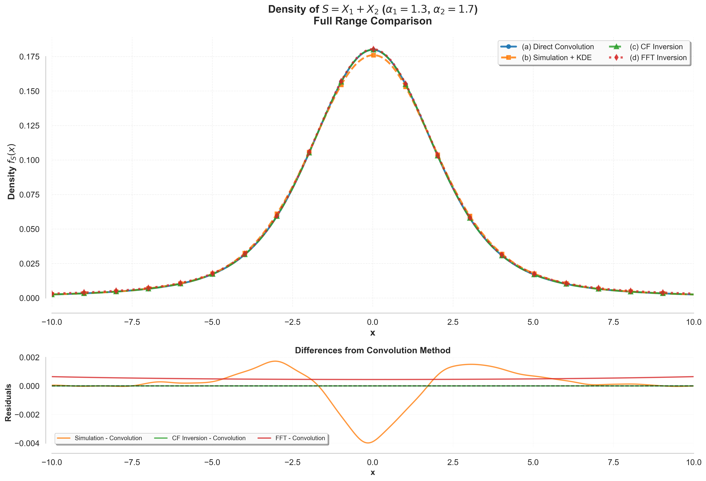
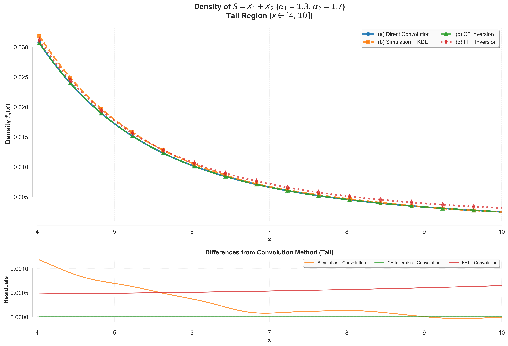

# Stable Sum Density Comparison

This mini-project reproduces the Part 1 assignment for the stable Paretian distribution entirely in Python. We compare four independent ways to recover the density of the sum

\[ S = X_1 + X_2, \]

where `X1 ~ Stable(α=1.3, β=0, σ=1, μ=0)` and `X2 ~ Stable(α=1.7, β=0, σ=1, μ=0)` are independent. The methods are:

1. **Direct convolution** of the two pdfs via numerical integration.
2. **Monte Carlo simulation** followed by a Gaussian kernel density estimate.
3. **Characteristic-function inversion** using the cosine-transform formula.
4. **FFT-based inversion** of the sum characteristic function (mirroring the MATLAB approach in *Intermediate Probability*, Chapter 2).

All four estimates are overlaid both on the full range `x ∈ [-10, 10]` and on the tail range `x ∈ [4, 10]`, showing that the methods agree closely.

## Prerequisites

- Python 3.11 (Conda environment already configured by VS Code).
- Packages: `numpy`, `scipy`, `matplotlib`, `seaborn`.

Install them (if needed) inside the workspace environment:

```bash
python -m pip install numpy scipy matplotlib seaborn
```

# Results




